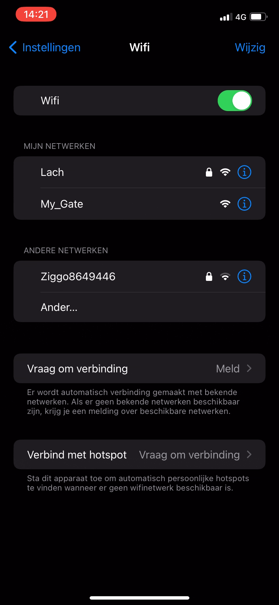
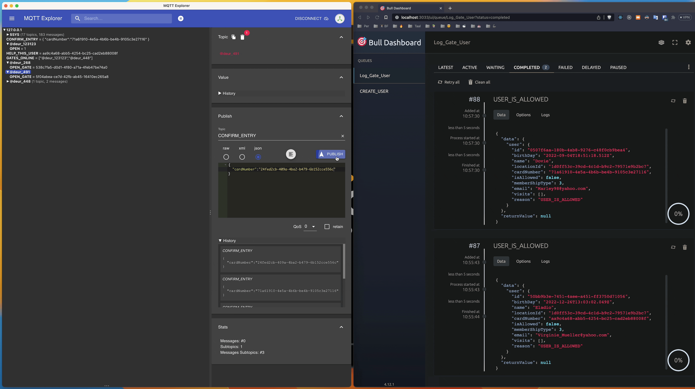
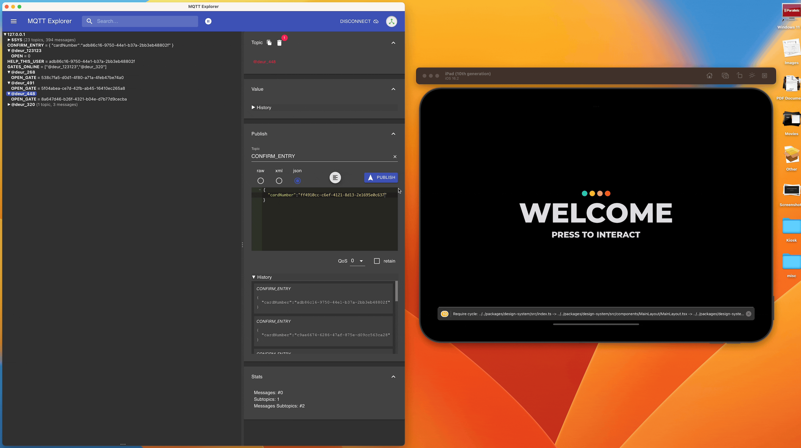

# Deur

A collection of apps and ideas, taken a bit to the extreme.

High lever over view:

- Base-App: Expo App to run on iPad
- Base-Cloud: Central server to save all User data and location settings
- Base-Kiosk: A NextJS App running the same code as the Expo App.
- Base-MQTT: A Mqtt server to communicate locally between "Access Points" and the "Base-Apps"
- Base-Local: Local Server to Manage the Location and using a Message Queue to Log requests to Cloud server.
- Base-StoryBook: A Storybook server to manage the design system

All communication happens over [TRPC](https://trpc.io). So Base-Local uses trpc to talk to Base-Cloud, Base-Kiosk uses TRPC to talk to Base-Cloud, Base-MQTT uses TRPC to talk to Base-Local.

Note: This is an experiment and code quality and documentation is not a priority, and there might be some odd choices made.

## Goals of Experiment:

### Developer

- TS Everywhere, C++ if you cant
- Tailwind Everywhere
- Easy to Deploy
- Easy to update
- Solid Github Actions
- Testable
- One Dev can Run Everything
- Design System with Storybook
- Documentation in Repo

### Business

- Monetize new features
- Cheap to Build
- Easy to Maintain
- Easy to Scale
- Easy to Update
- Fall Over Gracefully
- Replaceable Parts (Module)

Basic Kiosk Flows

Get Data from Local Cloud -> Save It to Local Database -> Get From there and Display
Create Person -> Save Locally -> In background pass To Local And Relay that up to cloud

# Working Gifs

### Create User at Location

### Hardware Demo

### Setup Hardware WIFI

### You aleady scanned in at location

### Successfully scanned in at location (MQ view)

### Design System Update

### Impossible Visit

